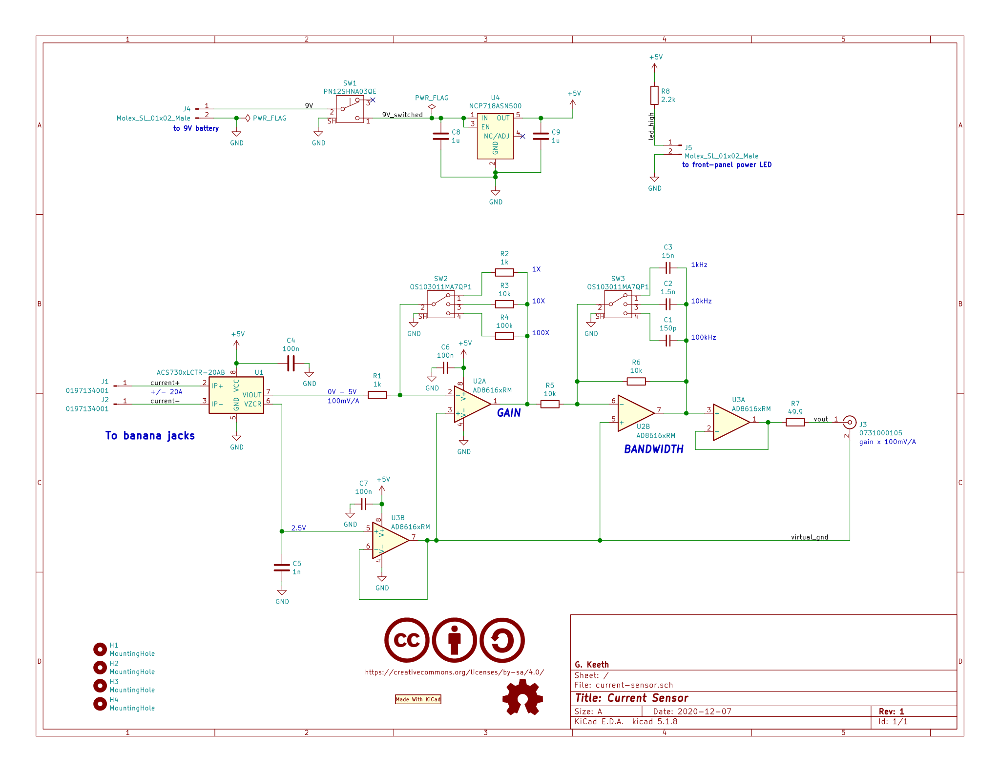
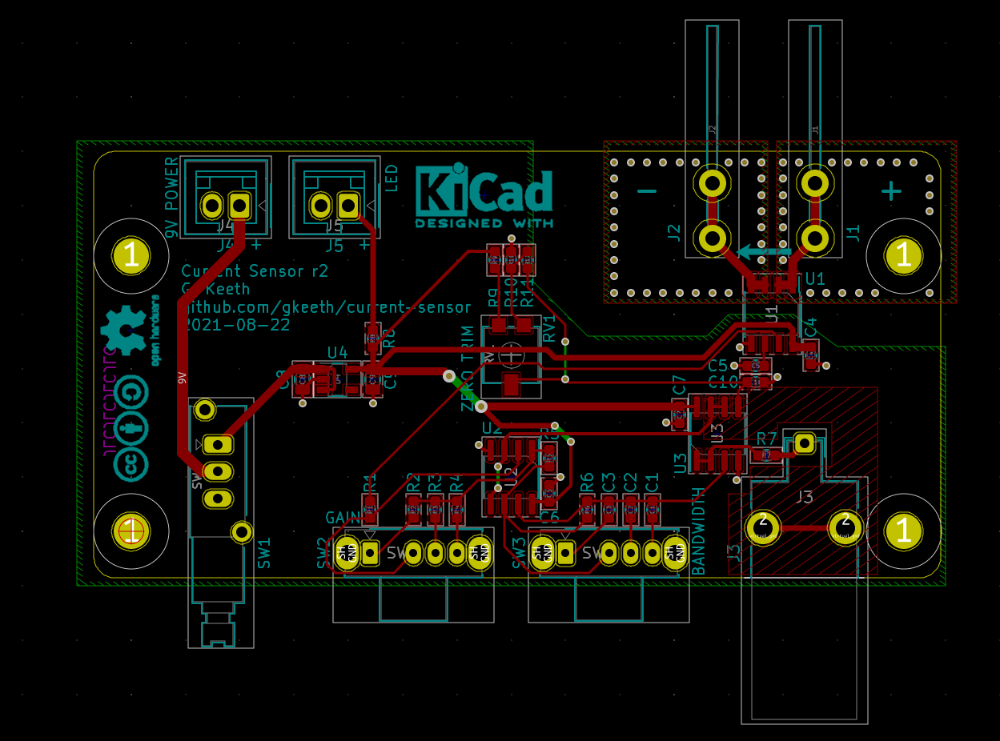
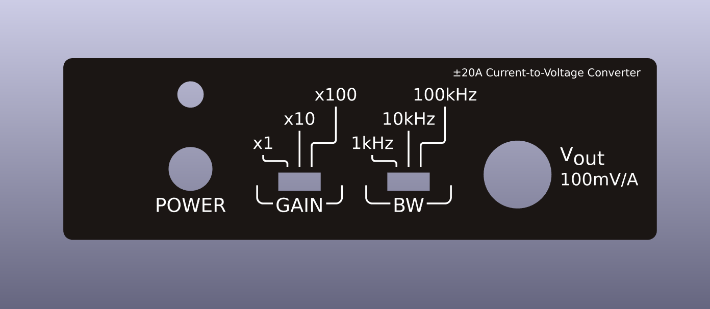
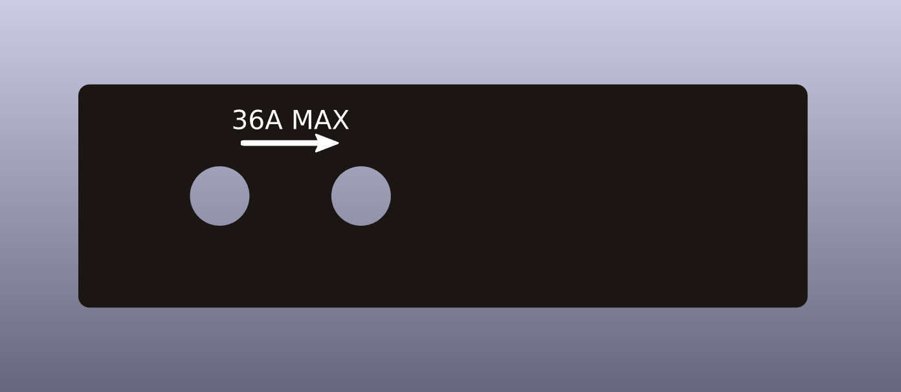
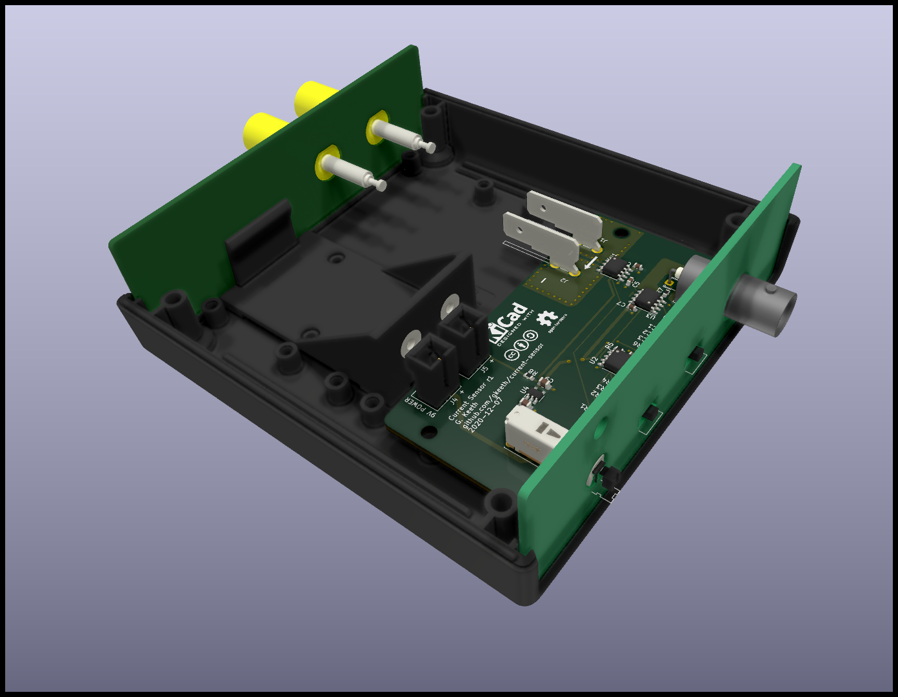

# current-sensor
Hall effect current sensor board. Invasive (connected in series with DUT), with BNC output to oscilloscope.

Designed to fit in Hammond 1593W enclosure. Powered by 9V battery. Includes PCBs for front and back panels (20A and 36A options for front panel).

WORK IN PROGRESS

## Specifications:
- Output: 0-5V, DC-coupled
- Maximum input current: +/-20A. Different current limits are possible by
selecting a different version of the ACS730 Hall effect IC (also changes sensitivity)
  - ACS730xxxxx-20AB: +/- 20A
  - ACS730xxxxx-40AB: +/- 40A [limited to 36A by binding posts]
- Gain: selectable between x1, x10, and x100
  - -20AB: x1 (100mV/A), x10 (1V/A), and x100 (10V/A)
  - -40AB: x1 (50mV/A), x10 (500mV/A), and x100 (5V/A)
- Bandwidth: selectable between 1kHz, 10kHz, and 100kHz
- Power supply: 9V battery

## Schematic:
[PDF of schematic](pdf/current-sensor.pdf)

## Layout:

## Front/Rear Panel and Assembly:

## License:
Licensed under the [Creative Commons Attribution-ShareAlike 4.0 International License][cc-by-sa].

[![CC BY-SA 4.0][cc-by-sa-image]][cc-by-sa]

[cc-by-sa]: http://creativecommons.org/licenses/by-sa/4.0/
[cc-by-sa-image]: https://licensebuttons.net/l/by-sa/4.0/88x31.png
